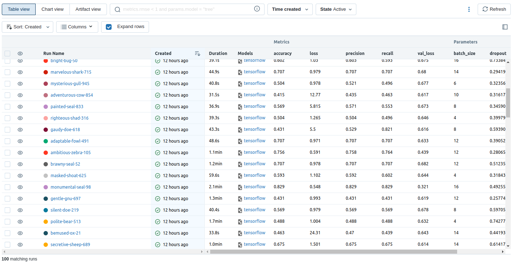

# Binary Image Classification using MLFlow

This repo contains an example of a Tensorflow CNN trained on a simple dataset containing roads and fields.
We perform hyperparameter optimization as well as experiment, model and artifacts tracking using MLFlow

## Create Virtual environment and install requirements
```bash
python3 -m venv venv
source venv/bin/activate
pip install -r requirements.txt
```

## Training
The following commands will run the training script
```bash
mlflow ui
```

And in another terminal:
```bash
python3 train.py
```

You can also pass the optional parameters epochs and max_evals, respectively for 
the number of epochs during each training run and the maximum number of training 
runs.

Example:

```bash
python3 train.py --epochs 50 --max_evals 10
```
This command will run 10 training runs, each with 50 epochs maximum.


You can then access MLFLow's UI at: http://127.0.0.1:5000/ and see your experiments' performances in real time, as seen on the picture below for example.




## Inference
For inferences, you need a dataset along with a model.

**N.B: The model present in the `model/` folder is already our best model, so feel free to test that one.**

For a dataset with the following structure:

```
.
├── ...
├── dataset                    
│   ├── fields          
│   ├── roads        
│   └── test_images # Subfolder containing both fields and roads images
└── ...
```

You should run the following command:

```bash
python3 inference.py --dataset_path "dataset/" --model_path "model/" --classes_names "test_images"
```
